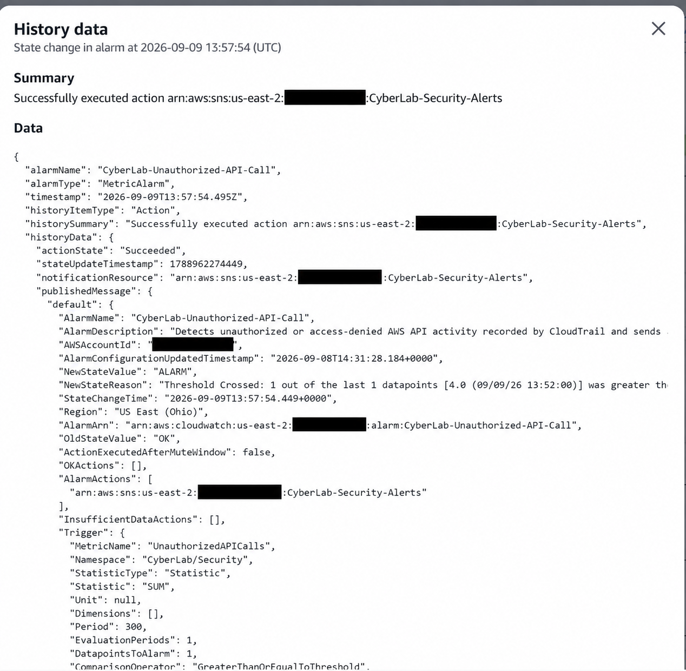

# AWS CloudTrail and CloudWatch Security Alerting

## Project Overview

This project demonstrates centralized AWS activity logging, security monitoring, alert generation, and notification using AWS CloudTrail, Amazon CloudWatch, and Amazon SNS.

A multi-Region CloudTrail trail records AWS management activity and delivers the events to Amazon S3 and CloudWatch Logs. A CloudWatch metric filter identifies unauthorized or access-denied API calls, while a CloudWatch alarm and SNS topic provide security notifications.

## Objectives

- Configure multi-Region AWS API activity logging.
- Protect the integrity of CloudTrail log files.
- Centralize CloudTrail events in CloudWatch Logs.
- Detect unauthorized and access-denied API activity.
- Create an alarm based on security-event thresholds.
- Deliver notifications through Amazon SNS.
- Validate the complete detection and alerting workflow.

## AWS Services Used

- AWS CloudTrail
- Amazon CloudWatch Logs
- Amazon CloudWatch Metrics
- Amazon CloudWatch Alarms
- Amazon Simple Notification Service
- Amazon Simple Storage Service
- AWS Identity and Access Management

## Architecture

```text
AWS API Activity
       |
       v
AWS CloudTrail
       |
       +----> Amazon S3
       |
       v
CloudWatch Logs
       |
       v
Security Metric Filter
       |
       v
CloudWatch Alarm
       |
       v
Amazon SNS Notification
```

## Implementation

### 1. CloudTrail Configuration

Created a multi-Region trail named:

```text
CyberLab-Security-Trail
```

The trail was configured with:

- Multi-Region logging enabled
- Management read and write events enabled
- Amazon S3 log delivery
- CloudWatch Logs integration
- Log file validation enabled
- Project and environment tags

### 2. CloudWatch Logs Integration

CloudTrail events were delivered to the following CloudWatch log group:

```text
aws-cloudtrail-cyberlab
```

This integration provided centralized access to AWS API activity for monitoring and detection.

### 3. Unauthorized API Detection

Created a CloudWatch metric filter to identify authorization failures recorded by CloudTrail.

```text
{ ($.errorCode = "*UnauthorizedOperation") || ($.errorCode = "AccessDenied*") }
```

Metric configuration:

```text
Namespace: CyberLab/Security
Metric name: UnauthorizedAPICalls
Metric value: 1
```

### 4. CloudWatch Alarm

Created the following security alarm:

```text
CyberLab-Unauthorized-API-Call
```

Alarm configuration:

```text
Threshold: Greater than or equal to 1
Evaluation period: 5 minutes
Datapoints to alarm: 1
Missing data: Treat missing data as not breaching
```

### 5. Amazon SNS Notification

Connected the CloudWatch alarm to the SNS topic:

```text
CyberLab-Security-Alerts
```

The email subscription was confirmed before testing the alarm.

## Detection Validation

A controlled unauthorized API test was performed using a restricted AWS identity. CloudTrail recorded the authorization failures, and the CloudWatch metric filter counted the matching events.

The validation produced four unauthorized API-call events. The metric crossed the configured threshold, causing the alarm to transition:

```text
OK → ALARM
```

CloudWatch successfully executed the SNS notification action. After the evaluation period passed without additional matching activity, the alarm returned to:

```text
ALARM → OK
```

## Evidence

### CloudWatch Alarm Activation and SNS Notification

The following evidence shows:

- Alarm name: `CyberLab-Unauthorized-API-Call`
- New state: `ALARM`
- Previous state: `OK`
- Four unauthorized API calls detected
- Threshold successfully crossed
- SNS notification action successfully executed
- Five-minute evaluation period
- Security metric namespace: `CyberLab/Security`



> Sensitive AWS account identifiers were redacted before publication.

## Security Skills Demonstrated

- AWS security monitoring
- Cloud activity logging
- Security-event detection
- CloudWatch metric-filter development
- Threshold-based alerting
- SNS notification integration
- IAM authorization-failure investigation
- Detection validation
- Evidence handling and sensitive-data redaction

## Project Result

This project successfully demonstrated an end-to-end AWS security-monitoring workflow:

```text
Unauthorized API activity
→ CloudTrail event
→ CloudWatch Logs
→ Metric-filter match
→ Alarm activation
→ SNS notification
```

## Security Considerations

- The testing was performed only within an authorized CyberLab environment.
- Sensitive AWS account identifiers were removed from published evidence.
- Additional CloudTrail data events and Insights events were not enabled to avoid unnecessary lab costs.
- Production thresholds should be tuned according to the organization’s activity baseline and risk requirements.
